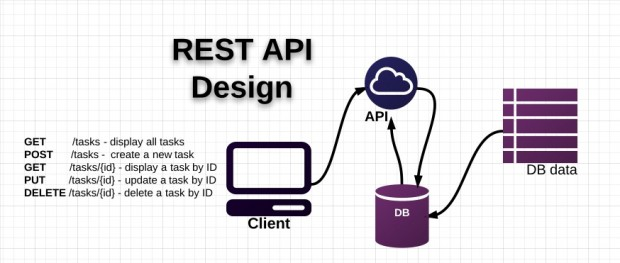
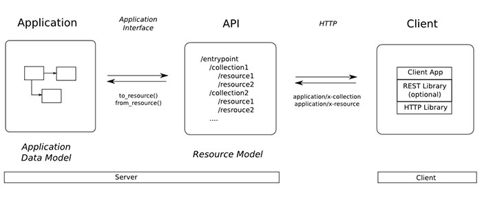

# Giới thiệu 

Có thể nói nguyên lí REST và cấu trúc dữ liệu RESTful được biết đến rộng rãi trong giới lập trình web nói chung và lập trình ứng dụng nói riêng.

Có thể nói bản thân REST không phải là một loại công nghệ. Nó là phương thức tạo API với nguyên lý tổ chức nhất định. Những nguyên lý này nhằm hướng dẫn lập trình viên tạo môi trường xử lý API request được toàn diện.

# RESTful API là gì?

RESTful API là một tiêu chuẩn dùng trong việc thiết kế API cho các ứng dụng web (thiết kế Web services) để tiện cho việc quản lý các resource. Nó chú trọng vào tài nguyên hệ thống (tệp văn bản, ảnh, âm thanh, video, hoặc dữ liệu động…), bao gồm các trạng thái tài nguyên được định dạng và được truyền tải qua HTTP.



# Diễn giải các thành phần

API (Application Programming Interface) là một tập các quy tắc và cơ chế mà theo đó, một ứng dụng hay một thành phần sẽ tương tác với một ứng dụng hay thành phần khác. API có thể trả về dữ liệu mà bạn cần cho ứng dụng của mình ở những kiểu dữ liệu phổ biến như JSON hay XML.

REST (REpresentational State Transfer) là một dạng chuyển đổi cấu trúc dữ liệu, một kiểu kiến trúc để viết API. Nó sử dụng phương thức HTTP đơn giản để tạo cho giao tiếp giữa các máy. Vì vậy, thay vì sử dụng một URL cho việc xử lý một số thông tin người dùng, REST gửi một yêu cầu HTTP như GET, POST, DELETE, vv đến một URL để xử lý dữ liệu.

RESTful API là một tiêu chuẩn dùng trong việc thiết kế các API cho các ứng dụng web để quản lý các resource. RESTful là một trong những kiểu thiết kế API được sử dụng phổ biến ngày nay để cho các ứng dụng (web, mobile…) khác nhau giao tiếp với nhau.

Chức năng quan trọng nhất của REST là quy định cách sử dụng các HTTP method (như GET, POST, PUT, DELETE…) và cách định dạng các URL cho ứng dụng web để quản các resource. RESTful không quy định logic code ứng dụng và không giới hạn bởi ngôn ngữ lập trình ứng dụng, bất kỳ ngôn ngữ hoặc framework nào cũng có thể sử dụng để thiết kế một RESTful API.

# RESTful hoạt động như thế nào?



REST hoạt động chủ yếu dựa vào giao thức HTTP. Các hoạt động cơ bản nêu trên sẽ sử dụng những phương thức HTTP riêng.

- GET (SELECT): Trả về một Resource hoặc một danh sách Resource.

- POST (CREATE): Tạo mới một Resource.

- PUT (UPDATE): Cập nhật thông tin cho Resource.

- DELETE (DELETE): Xoá một Resource.

Những phương thức hay hoạt động này thường được gọi là CRUD tương ứng với Create, Read, Update, Delete – Tạo, Đọc, Sửa, Xóa.

Hiện tại đa số lập trình viên viết RESTful API giờ đây đều chọn JSON là format chính thức nhưng cũng có nhiều người chọn XML làm format, nói chung dùng thế nào cũng được miễn tiện và nhanh.

# Authentication và dữ liệu trả về

RESTful API không sử dụng session và cookie, nó sử dụng một access_token với mỗi request. Dữ liệu trả về thường có cấu trúc như sau:
``` 
{
    "data" : {
        "id": "1",
        "name": "TopDev"
    }
}
```

# Status code

Khi chúng ta request một API nào đó thường thì sẽ có vài status code để nhận biết sau:

- 200 OK – Trả về thành công cho những phương thức GET, PUT, PATCH hoặc DELETE.

- 201 Created – Trả về khi một Resouce vừa được tạo thành công.

- 204 No Content – Trả về khi Resource xoá thành công.

- 304 Not Modified – Client có thể sử dụng dữ liệu cache.

- 400 Bad Request – Request không hợp lệ

- 401 Unauthorized – Request cần có auth.

- 403 Forbidden – bị từ chối không cho phép.

- 404 Not Found – Không tìm thấy resource từ URI

- 405 Method Not Allowed – Phương thức không cho phép với user hiện tại.

- 410 Gone – Resource không còn tồn tại, Version cũ đã không còn hỗ trợ.

- 415 Unsupported Media Type – Không hỗ trợ kiểu Resource này.

- 422 Unprocessable Entity – Dữ liệu không được xác thực

- 429 Too Many Requests – Request bị từ chối do bị giới hạn

***Chú ý***

Luôn sử dụng version để khi bạn cần nâng cấp API mà vẫn hỗ trợ các API cũ.