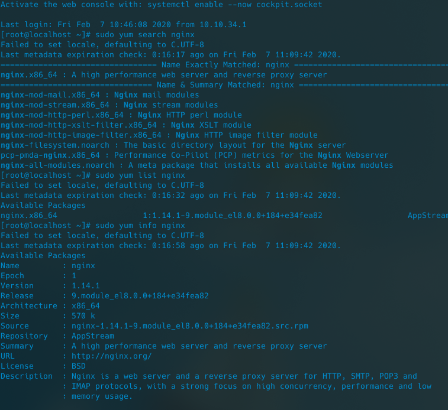
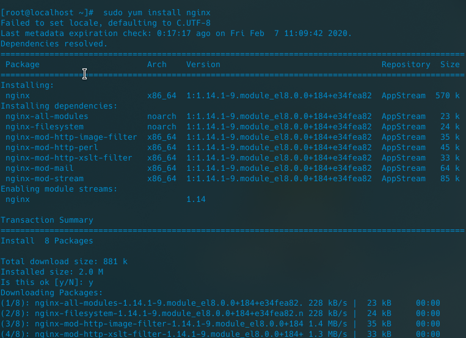
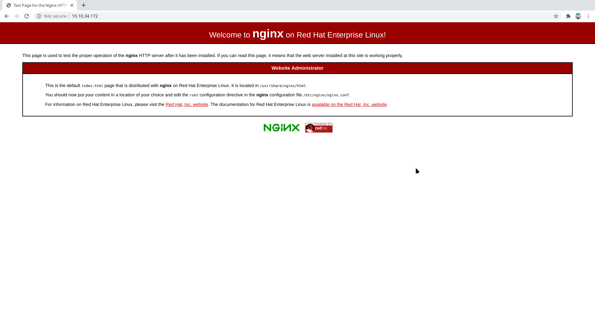
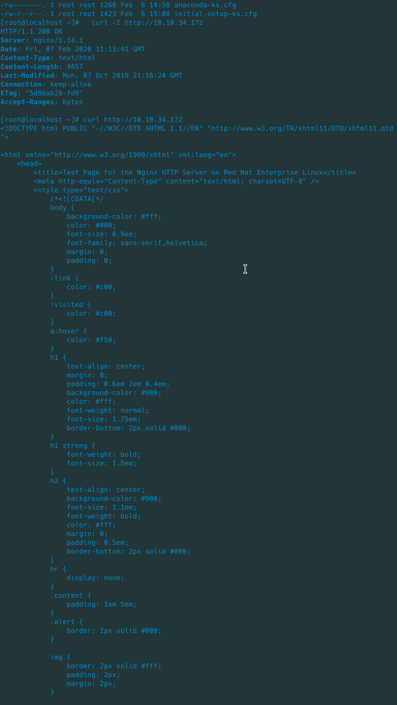
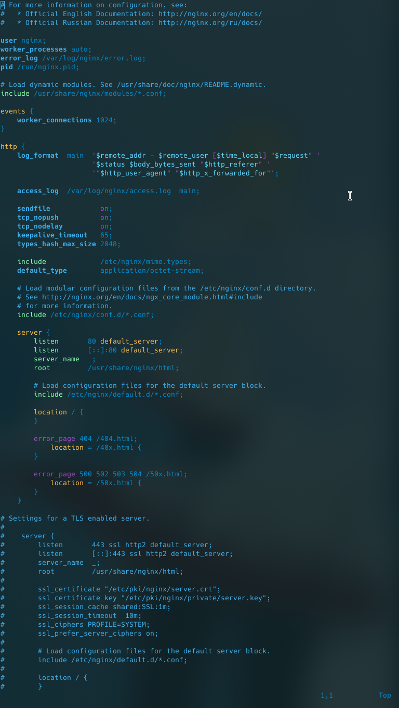

# Hướng dẫn cài và sử dụng NginX trên Centos 8

## NginX là gì ?

`Nginx` là 1 trong những Web Server phổ biến, được sử dụng trong nhiều hệ thống máy chủ Web trên thế giới.

`Nginx` là một Web Server nhẹ, mạnh mẽ và sử dụng kiến trúc đơn luồng, hướng sự kiện vì thế nó sử dụng tài nguyên hợp lý hơn `Apache Server`. Vì vậy nó thường được sử dụng phổ biến với các nhiệm vụ như là Load Balancing, HTTP caching, hay sử dụng như một Reverse Proxy.

## Đôi nét về NginX

- Tác giả: Igor Sysoev

- Phát triển bởi Nginx, Inc.

- Phát hành lần đầu vào 04/10/2004
- Phiên bản ổn định: 1.14.1 
- Repository: hg.nginx.org/nginx
- Ngôn ngữ lập trình: C
- OS: BSD variants, HP-UX, IBM AIX, Linux, macOS, Solaris, Windows
- Loại phần mềm: Web server, reverse/mail proxy server
- Website: nginx.org

## Cài đặt NginX trên Centos 8

### Bước 1: Update hệ thống Centos 8 

Giữ cho hệ thống, kernel và ứng dụng đã cài đặt của bạn luôn ở phiên bản mới nhất là một nhiệm vụ thiết yếu. Vì vậy, để cập nhật hệ thống, chạy câu lệnh dưới đây :
```
sudo yum updateinfo
sudo yum update
## Reboot the system if a new kernel update was installed ##
sudo reboot
```

### Bước 2: Tìm kiếm gói cài đặt 
```
sudo yum search nginx
sudo yum list nginx
```
Kiểm tra version mình chuẩn bị cài đặt

```
sudo yum info nginx
```


### Bước 3: Cài đặt NginX

```
sudo yum install nginx
```




### Bước 4: Khởi động NginX 

Đầu tiên, kích hoạt dịch vụ `NginX` bằng cách chạy lệnh `systemctl` để nó khởi động khi máy khởi động:
```
sudo systemctl enable nginx
```
Sample outputs:
```
Created symlink /etc/systemd/system/multi-user.target.wants/nginx.service → /usr/lib/systemd/system/nginx.service.
```

Gõ câu lệnh sau để chạy dịch vụ:
```
sudo systemctl start nginx
```

Các câu lệnh start/stop/restart NginX Server ( chỉ chạy khi cần )
```
sudo systemctl start nginx ## &lt-- start the server ##
sudo systemctl stop nginx ## &lt-- stop the server ##
sudo systemctl restart nginx ## &lt-- restart the server ##
sudo systemctl reload nginx ## &lt-- reload the server ##
sudo systemctl status nginx ## &lt-- get status of the server ##
```

### Bước 5: mở port 80 and 443 dùng `firewall-cmd`

Trên Centos mặc định tường lửa là `firewalld`, cho nên khi cài dịch vụ mới, ta cần thêm dịch vụ ý vào firewalld để nó không ngăn cản ta sử dụng internet.

```
$ sudo firewall-cmd --permanent --zone=public --add-service=http --add-service=https
$ sudo firewall-cmd --reload
$ sudo firewall-cmd --list-services --zone=public
```

### Bước 6: Kiểm tra

Xác minh rằng cổng 80 hoặc 443 đã mở bằng lệnh ss:

```
sudo ss -tulpn
```

Sample outputs (look out for :80 and :443 lines) :


```
Netid       State         Recv-Q        Send-Q                    Local Address:Port               Peer Address:Port                                                                                               
udp         UNCONN        0             0                     10.147.164.2%eth0:68                      0.0.0.0:*           users:(("NetworkManager",pid=50,fd=15))                                                
tcp         LISTEN        0             128                             0.0.0.0:80                      0.0.0.0:*           users:(("nginx",pid=1316,fd=6),("nginx",pid=1315,fd=6),("nginx",pid=1314,fd=6))        
tcp         LISTEN        0             128                                [::]:80                         [::]:*           users:(("nginx",pid=1316,fd=7),("nginx",pid=1315,fd=7),("nginx",pid=1314,fd=7)) 
tcp         LISTEN        0             128                                [::]:443                         [::]:*           users:(("nginx",pid=1316,fd=7),("nginx",pid=1315,fd=7),("nginx",pid=1314,fd=7))
```

Nếu bạn không biết địa chỉ IP máy chủ của mình, hãy chạy lệnh ip sau:
```
ip a
```
Sample outputs:

```
[root@localhost ~]# ip a
1: lo: <LOOPBACK,UP,LOWER_UP> mtu 65536 qdisc noqueue state UNKNOWN group default qlen 1000
    link/loopback 00:00:00:00:00:00 brd 00:00:00:00:00:00
    inet 127.0.0.1/8 scope host lo
       valid_lft forever preferred_lft forever
    inet6 ::1/128 scope host 
       valid_lft forever preferred_lft forever
2: ens3: <BROADCAST,MULTICAST,UP,LOWER_UP> mtu 1500 qdisc fq_codel state UP group default qlen 1000
    link/ether 52:54:00:67:69:7c brd ff:ff:ff:ff:ff:ff
    inet 10.10.34.172/24 brd 10.10.34.255 scope global noprefixroute ens3
       valid_lft forever preferred_lft forever
    inet6 fe80::ab76:997a:3444:49f6/64 scope link noprefixroute 
       valid_lft forever preferred_lft forever
3: virbr0: <NO-CARRIER,BROADCAST,MULTICAST,UP> mtu 1500 qdisc noqueue state DOWN group default qlen 1000
    link/ether 52:54:00:39:65:e5 brd ff:ff:ff:ff:ff:ff
    inet 192.168.122.1/24 brd 192.168.122.255 scope global virbr0
       valid_lft forever preferred_lft forever
4: virbr0-nic: <BROADCAST,MULTICAST> mtu 1500 qdisc fq_codel master virbr0 state DOWN group default qlen 1000
    link/ether 52:54:00:39:65:e5 brd ff:ff:ff:ff:ff:ff
```

Vậy địa chỉ IP của tôi là `10.10.34.172`. Mở trình duyệt web và nhập URL (tên miền) địa chỉ IP:

```
http://10.10.34.172
```



Chúng ta cũng có thể sử dụng lệnh curl để có được thông tin tương tự bằng cách sử dụng cli:

```
curl -I http://10.10.34.172
curl http://10.10.34.172
```



### Bước 7: Cấu hình NginX Server


- CentOS 8 Nginx Config directory – /etc/nginx/

- Master/Global config file – /etc/nginx/nginx.conf
- TCP ports opened by Nginx – 80 (HTTP), 443 (HTTPS)
- Document root directory – /usr/share/nginx/html


Để chỉnh sửa tập tin, hãy sử dụng trình soạn thảo văn bản như lệnh vi / vim / nano:

